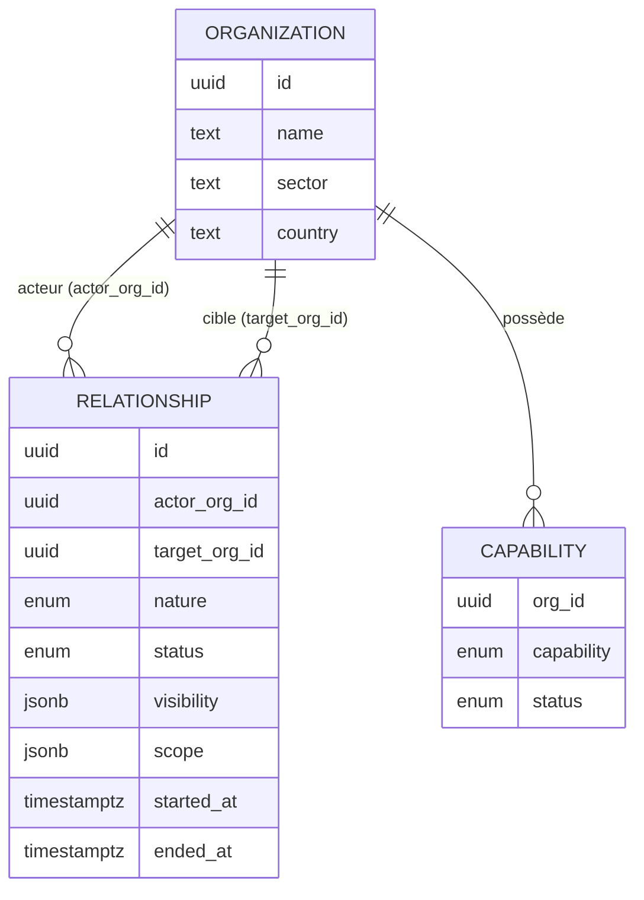
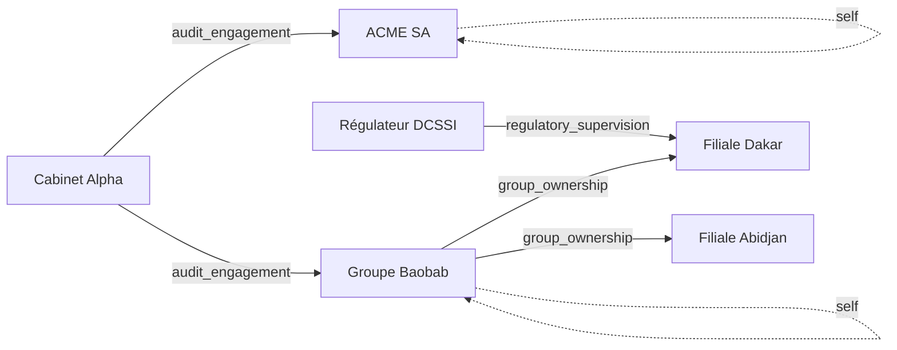

# RFC 0001 — Modèle relationnel des organisations & modularité

> **Statut** : **Accepté — décisions actées le 2026-07-29** · **Portée** : cœur de domaine (organisations, relations, modules, RLS)
> **Suite** : migration additive (`organization_relationships` + capacités) puis Hub-cockpit & Gëstu Risk bâtis nativement sur le graphe.

---

## 1. Problème

Le modèle actuel encode trois notions distinctes dans des mécanismes incohérents :

- **`organizations.types[]`** ∈ `{cabinet, client, group, platform}` (00094). Or `cabinet`/`client` ne sont **pas des propriétés** d'une org : ce sont des **rôles relatifs** (« client *de qui* ? »). On a mis une **arête de graphe dans une colonne**.
- **Trois relations identiques**, modélisées de deux façons : `parent_org_id` (groupe→filiale, 00001), `cabinet_clients` (cabinet→client, 00028), et **Regul qui détourne** `parent_org_id` pour régulateur→assujetti (cf. `src/lib/product.ts`).
- **La modularité est pilotée par le type et un fork de build** (`VITE_PRODUCT` comply/regul), alors que « superviser des assujettis » est le **même moteur** audit/risque appliqué à une autre nature de relation.

**Cause racine** : confusion entre *ce qu'une org **est*** (identité), *ce qu'elle **fait à qui*** (relation) et *ce qu'elle a le **droit** d'utiliser* (capacité).

---

## 2. Objectifs / non-objectifs

**Objectifs**
- Un modèle unique où *cabinet / groupe / régulateur / abonné* sont **émergents**, pas stockés.
- Une org (et ses données) **durable** ; les relations vont et viennent.
- La **visibilité** portée par la relation, pas par un type.
- Les **modules = capacités** activables, indépendantes du type et du produit.
- Simplifier et durcir la RLS (accès **par arête**).

**Non-objectifs (v1)**
- Refonte de la facturation/plans (on branchera les capacités dessus plus tard).
- Suppression immédiate de `types[]` / `VITE_PRODUCT` (dépréciation progressive).
- Historisation/tendance du Trust Score (RFC séparée).

---

## 3. Modèle cible — 3 axes orthogonaux

### 3.1 Organisation (entité)
Attributs **intrinsèques uniquement** : `id, name, sector, size, country, created_at`. Plus de rôle relationnel dans l'entité.

### 3.2 Relation (arête typée, dirigée)
`organization_relationships(actor_org_id, target_org_id, nature, status, visibility, scope, started_at, ended_at)`.

- `nature ∈ {self, audit_engagement, group_ownership, regulatory_supervision, delegation}`
- `status ∈ {active, ended, suspended}`
- `visibility` : contrat de ce que l'acteur voit de la cible (défaut par nature, surchargeable par le propriétaire de la donnée = la cible).
- `scope` : optionnel (inclut les descendants ? réfèrentiel ? lien mission).
- Contraintes : `self` ⇒ `actor = target` ; unicité d'une arête *active* par `(actor, target, nature)`.

### 3.3 Capacité (module / entitlement)
`organization_capabilities(org_id, capability, status)` avec `capability ∈ {comply, risk, policy, privacy, awareness, incidents, measures, supervision}`.
« **Regul** » n'est plus un produit : c'est un **preset** = arêtes `regulatory_supervision` + capacités `{comply, incidents, measures}` + vocabulaire « assujetti ». L'instance dédiée devient un **choix d'hébergement** (souveraineté), pas un fork de domaine.



### 3.4 Édition (preset de déploiement)
Une **édition** est un **profil de configuration nommé** (donnée, pas code) qui regroupe **capacités activées + vocabulaire + branding + workflows par défaut**. Elle **remplace le fork `VITE_PRODUCT`**.

| Dimension | Édition « Regul » | Édition « ETP complète » |
|---|---|---|
| Capacités | comply, supervision, incidents, measures | comply, risk, policy, privacy, awareness |
| Vocabulaire | assujetti / supervision | client / audit |
| Branding | Gëstu Regul | Gëstu ETP |
| Perspective défaut | supervision | portefeuille / self |

**Trois niveaux à ne pas confondre** : *capacité* (brique atomique) → *entitlement* (capacités autorisées d'une org, §3.3) → *édition* (preset opinionné pour un déploiement/segment). `productVocab` devient un cas particulier du **résolveur d'édition** au runtime.

### 3.5 Topologies de déploiement (axe indépendant)
L'édition (**quoi + allure**) est orthogonale à la topologie (**où ça tourne**) :
- **SaaS mutualisé** — Gëstu héberge, isolation par RLS + graphe ;
- **Dédié hébergé** — une instance par client, gérée par Gëstu ;
- **Auto-hébergé souverain** — le client installe le **même** paquet sur son infra (cas DCSSI).

La même édition « Regul » tourne en SaaS **ou** en auto-hébergé souverain. Le besoin souverain initial = **topologie « auto-hébergé » + édition « Regul »**, **sans fork de domaine**.

**Prérequis auto-hébergement** (RFC packaging séparée) : paquet déployable (image/compose ou projet Supabase du client) ; **fournisseurs externes branchables/dégradables** (IA Anthropic, email Resend, horodatage TSA) pour un contexte potentiellement air-gap ; activation des capacités **hors-ligne** (pas de phone-home).

---

## 4. Natures de relations & matrice de visibilité (le cœur)

Tout repose sur *ce qui traverse chaque arête*. Contrats **par défaut** (la cible, propriétaire, peut élargir/restreindre) :

| Nature | L'acteur voit de la cible | Durée | Historique | Interne de la cible |
|---|---|---|---|---|
| `self` | tout | permanent | tout | — (c'est soi) |
| `audit_engagement` | le **périmètre de la mission** (référentiels, contrôles, preuves de cet engagement) | durée de l'engagement | **non partagé** entre cabinets par défaut | non (sauf partage explicite par la cible) |
| `group_ownership` | posture **consolidée** + détail selon la gouvernance du groupe | tant que la filiale est rattachée | oui, au sein du groupe | selon politique groupe |
| `regulatory_supervision` | **strictement le légalement requis** (déclarations, incidents, mesures) | tant qu'assujetti | oui, sur les obligations | non |
| `delegation` | sous-périmètre délégué par le chef de file | durée de la délégation | via le chef de file | non |

**Règle unique d'accès** : *un utilisateur de l'org A voit une ressource de l'org T si (A = T, arête `self`) ou s'il existe une arête active `A —[nature]→ T` dont la `visibility` couvre ce type de ressource.*

---

## 5. Rôle & modularité émergents

- **Rôle** = observation du graphe : arêtes `audit_engagement` sortantes ⇒ *se comporte en cabinet* ; `group_ownership` ⇒ *groupe* ; `regulatory_supervision` ⇒ *régulateur* ; seulement `self` ⇒ *org autonome*. Cumulables sans contradiction.
- **Modularité** = capacités de l'org (ce qu'elle voit dans son Hub) croisées avec les natures d'arêtes (ce qu'elle peut faire, et sur qui). Le **type ne gate plus le module**.

### Exemple de graphe réel

*Lecture : le cabinet audite ACME et le groupe ; le groupe possède deux filiales ; le régulateur supervise une des filiales ; ACME et le groupe gèrent aussi leur propre posture. Aucune de ces situations n'a besoin d'un « type » — ce sont des arêtes.*

---

## 6. Parcours du graphe (Hub & Trust Score)

- **Perspectives du Hub** = directions de parcours des arêtes sortantes de l'org courante : `self` → « Mon organisation » ; `audit_engagement` → « Portefeuille clients » ; `group_ownership` → « Groupe/filiales » ; `regulatory_supervision` → « Supervision ». La bascule n'affiche que les perspectives existantes.
- **Trust Score** : calculé sur le `self` de chaque org, puis **agrégé le long des arêtes** (roll-up groupe le long de `group_ownership` ; portefeuille le long de `audit_engagement`). La question « pour soi / clients / filiales » disparaît.

---

## 7. Validation par les cas

Les 14 cas étudiés passent sans exception ni cas particulier codé en dur (extrait) :

| Cas | Représentation |
|---|---|
| Cabinet ↔ clients | `C —[audit_engagement]→ X, Y` |
| Client qui gère aussi sa conformité | `C —[audit_engagement]→ X` **+** `X —[self]` + capacités |
| Client + filiales dans le périmètre | `X —[group_ownership]→ S…` **+** `C —[audit_engagement, scope=X+desc]→ X` |
| Groupe qui gère ses filiales | `G —[group_ownership]→ S…` + `G —[self]` |
| Ex-client → usage propre | arête audit `ended` ; `X —[self]` activée — **données conservées** |
| Retour via un autre cabinet | même `X` ; `C2 —[audit_engagement]→ X` ; historique partagé **si X le décide** |
| Assujetti → abonné | `R —[regulatory_supervision]→ A` **+** `A —[self]` (coexistent) |
| Cabinet **et** client | arêtes sortantes **et** entrantes `audit_engagement` + `self` |
| Deux régulateurs | deux arêtes `regulatory_supervision` à périmètres distincts |
| M&A / sortie de groupe | `group_ownership` de G1 close, nouvelle vers G2 — org persiste |

Le modèle actuel échoue dès « client qui gère sa conformité », « retour via un autre cabinet », « cabinet-et-client » et « deux régulateurs ».

---

## 8. Impact RLS / sécurité

Aujourd'hui : empilement de helpers (`get_subsidiary_ids`, `get_my_client_org_ids`, `get_my_organization_id` neutralisé pour `role=client`, `cpc.entity_org_id`, policies `cp_*`).

Cible : **une seule primitive** —
```
visible_target_ids(viewer_org_id, resource_kind) :=
  { T | arête active viewer_org_id —[nature]→ T,
        et visibility(nature) couvre resource_kind }
  ∪ { viewer_org_id }   -- self
```
- Chaque policy sensible devient : `org_id IN visible_target_ids(get_my_organization_id(), '<kind>')`.
- Le **portail** (client/assujetti) = un utilisateur dont l'org est *cible* d'arêtes entrantes ; il voit son `self` + ce que les arêtes entrantes exposent.
- Bénéfice sécurité : le contrôle d'accès **par arête** est plus rigoureux et auditable qu'un empilement de helpers ; la visibilité est **déclarative**.
- Coût : refonte du cœur RLS ⇒ **migration incrémentale obligatoire** (§9), avec fonctions de compatibilité.

---

## 9. Plan de migration incrémental (sans big-bang)

1. **Additif** : créer `organization_relationships` + `organization_capabilities` (aucune rupture).
2. **Backfill** (idempotent) :
   - chaque org → arête `self` ;
   - `cabinet_clients(cabinet_id, client_org_id)` → `audit_engagement(actor=cabinet, target=client)` ;
   - `parent_org_id` (hors Regul) → `group_ownership(actor=parent, target=enfant)` ;
   - sous-arbres Regul → `regulatory_supervision` (marqueur produit/config pour distinguer d'un vrai groupe) ;
   - capacités dérivées du plan/produit courant.
3. **Compat RLS** : introduire `visible_target_ids()` *à côté* des helpers actuels (les anciens deviennent des vues sur les arêtes).
4. **Nouveau code sur le graphe** : Hub-cockpit + Trust Score + Gëstu Risk lisent directement les arêtes.
5. **Bascule table par table** des policies existantes vers la primitive d'arête.
6. **Dépréciation** : `types[]` devient **dérivé** (vue calculée) puis retiré ; `VITE_PRODUCT` réduit à un concept de branding/hébergement (plus de domaine).

Chaque étape est réversible (migrations `up`/`down`) et n'interrompt pas l'existant.

---

## 10. Décisions actées (2026-07-29)

- **Principe** : ✅ **validé** (entité / arête typée / capacité, visibilité portée par l'arête, rôle émergent).
- **#1 — Natures v1** : `self`, `audit_engagement`, `group_ownership`, `regulatory_supervision` (`delegation` plus tard, même mécanisme).
- **#2 — Visibilité** : **surcharges par arête dès la v1** (défauts par nature + la cible peut élargir/restreindre chaque arête).
- **#3 — Mission ↔ engagement** : **liaison dès la v1** (`mission.engagement_id` → arête `audit_engagement`).
- **#4 — Roll-up groupe** : **pondération configurable dès la v1** (le groupe fixe le poids de chaque filiale ; défaut = pondéré par exposition).
- **#5 — Trust Score v1** : **conformité seule + dégradation gracieuse** (affiché dès maintenant, « score partiel » tant que les autres modules ne contribuent pas).
- **#6 — Regul** : **domaine unifié ; Regul = édition (module + preset, §3.4)** ; le besoin souverain est couvert par la **topologie « auto-hébergé » (§3.5)**, pas par un fork de domaine.
- **#7 — Historique inter-cabinets** : **opt-in par la cible** (un nouveau cabinet ne voit pas le travail d'un précédent sauf partage explicite par l'org).

---

## 11. Prochaines étapes

- ✅ Principe & décisions actées (§10).
- Migration **additive** `NNNNN_organization_relationships_up/_down.sql` + `organization_capabilities`, avec visibilité **surchargeable par arête** et `mission.engagement_id` (décisions #2, #3).
- **Backfill** depuis `cabinet_clients`, `parent_org_id`, sous-arbres Regul + capacités dérivées du plan/produit courant.
- Primitive RLS `visible_target_ids()` en **compatibilité** (étape 3), puis bascule table par table.
- **Hub-cockpit + Gëstu Risk bâtis nativement sur le graphe** (Trust Score = conformité + dégradation gracieuse).
- **RFC séparée « packaging & éditions »** : prérequis auto-hébergement souverain (fournisseurs externes branchables, activation hors-ligne).
